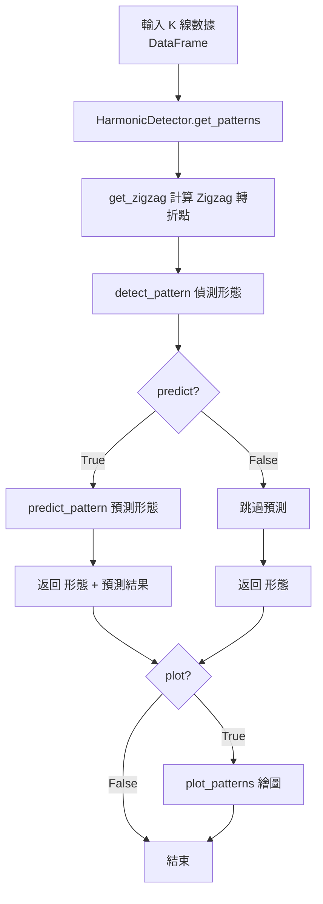

# 整體偵測流程

## 流程圖



## API 說明

| 方法 | 說明 |
|------|------|
| `get_patterns(df, window, predict, plot)` | 主入口，輸入 K 線資料輸出形態 |
| `get_zigzag(df, period)` | 計算價格轉折點 |
| `detect_pattern(zigzag_pattern)` | 偵測已完成的形態 |
| `predict_pattern(zigzag_pattern)` | 預測未來形態 |
| `plot_patterns(...)` | 繪製形態圖形 |

## 使用範例

```python
from harmonic_patterns import HarmonicDetector

detector = HarmonicDetector(error_allowed=0.05)
patterns, predict = detector.get_patterns(df, window=5, predict=True, plot=False)
```
