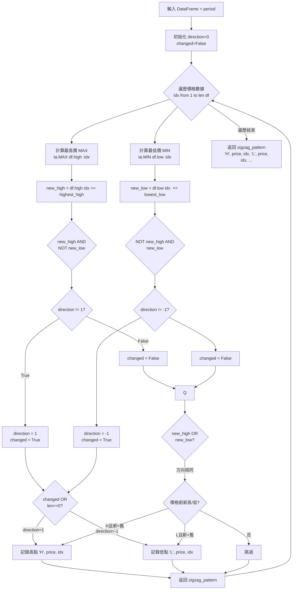

# Zigzag 計算流程

## 流程圖

## 說明

- **Zigzag** 識別價格走勢中的轉折點（波峰/波谷）
- 使用 `ta.MAX` 和 `ta.MIN` 計算指定週期內的最高/最低價
- 輸出格式：`[['H', price, idx], ['L', price, idx], ...]`
  - `H` = High (高點)
  - `L` = Low (低點)
  - `price` = 價格
  - `idx` = 資料索引

## 參數

| 參數 | 說明 |
|------|------|
| `df` | K 線數據 DataFrame (需包含 high, low 欄位) |
| `period` | 計算週期，用於判斷高低點 |
