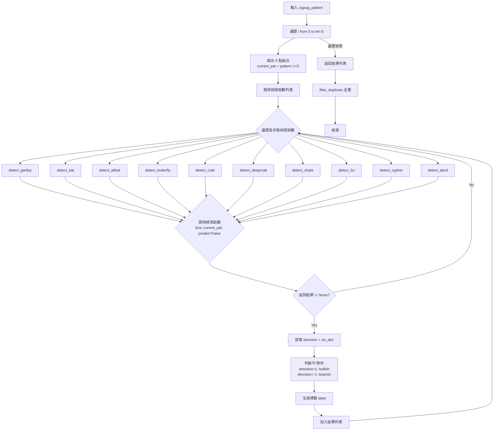
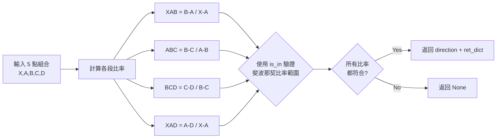

# 形態偵測流程

## 流程圖



## 形態偵測函數

| 函數 | 形態名稱 | 關鍵斐波那契比率 |
|------|----------|------------------|
| `detect_gartley` | Gartley | XAB=0.618, XAD=0.786 |
| `detect_bat` | Bat | XAB=0.618, XAD=0.886 |
| `detect_altbat` | Alt Bat | XAB=0.618, XAD=1.13 |
| `detect_butterfly` | Butterfly | XAB=0.618, XAD=1.27 |
| `detect_crab` | Crab | XAB=0.618, XAD=1.618 |
| `detect_deepcrab` | Deep Crab | XAB=0.886, XAD=1.618 |
| `detect_shark` | Shark | XAB=0.618, XAD=1.13 |
| `detect_5o` | 5-O | XAB=1.618, XAD=1.618 |
| `detect_cypher` | Cypher | XAB=0.618, XAD=0.786 |
| `detect_abcd` | AB=CD | AB=CD (1:1) |

## 單一形態檢測流程



## 檢測模式

- **predict=False**: 偵測已完成的形態
- **predict=True + predict_mode='reverse'**: 反向預測（從 X,A,B,C 預測 D）
- **predict=True + predict_mode='direct'**: 直接預測（驗證當前 D 點是否有效）

## 輸出格式

```python
[
    [current_pat, current_idx, label, ret_dict],
    ...
]
```

- `current_pat`: 5 點價格列表
- `current_idx`: 對應的資料索引
- `label`: 如 "bullish gartley", "bearish bat"
- `ret_dict`: 包含各段比率的字典
